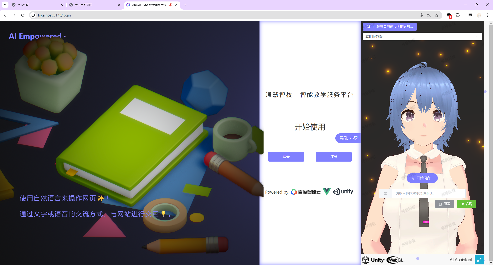

<h1> AI赋能的智能教学辅助平台💯</h1>

支持**自然语言交互**的智能教学辅助平台

[**简体中文**](./README.md) | [**English**](./docs/en/README.md) | [**日本語**](./docs/jp/README.md)

---

## Vue + Unity(WebGL)的智能教学辅助平台📚

***
### 仍在火热施工中🔨...
***

使用大语言模型作为你的私人助理，让（他/她/它）帮助你在教学平台上进行导航，查询教学信息，总结网页内容，解决你的疑难，满足你的要求，甚至是与（他/她/它）聊天说地，谈情说爱等！

***
### 提供全新的网页交互逻辑👾！
不再需要用鼠标在繁琐复杂各个网页条目、导航下点击浏览；不再需要去学习繁琐的网页业务逻辑、操作方式；不再需要观察分析网页展示的个各种冷冰冰的图表数据。
#### 通过文字和语音的方式，使用自然语言来操作网页✨！
通过智能教学助理进行文字或语音交流， 智能教学助理将帮助你跳转到相应的网页模块下，并协助你总结网页内容，分析图表数据，协助你无阻碍畅游教学平台，完成教学任务。
***
### 认识你的智能教学助理---小慧❤️！

通过语音转文本（STT）、大语言模型（LLM）、文本转语音（TTS）等技术，
我们创造了智能教学助理小慧，并把她介绍给你🥰。

不想学习复杂的教学平台的业务逻辑？没关系！
让小慧来帮助学生提交作业、完成任务；帮助教师完成对课堂进行考勤、布置作业的繁琐操作。

无论是任何任务，只需跟小慧说一句话，小慧势必为你赴汤蹈火，并尽其所能地满足你的需求！
***
##### 语音转文本（STT）由百度提供的短语音识别极速版服务实现
##### 大语言模型（LMM）为百度提供的ERNIE 3.5
##### 文本转语音 （TTS）通过GitHub项目[GPT-SoVits](https://github.com/RVC-Boss/GPT-SoVITS)实现
***
### 如何运行此平台❓
平台目前仍在建设中...

#### 环境准备🔨：
***
此GitHub仓库只包含了前端项目，前端使用Vue构建，使用npm（Node Package Manager）
作为包管理工具，并使用了[Element-Plus](https://element-plus.org/)前端框架。

在运行项目前请先使用
`npm instal`
来安装package.json中所需要的库和依赖

使用
`
npm run dev
`
即可启动项目，进行抢先预览体验。

#### 须知❗：
***
智能人工助理小慧需要与服务端进行数据通信才可进行工作，
目前服务端项目仍未上传至GitHub中。

