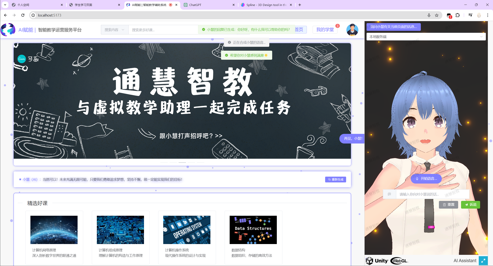
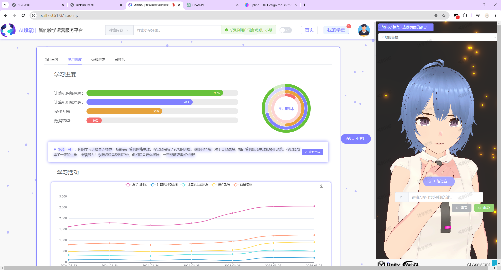
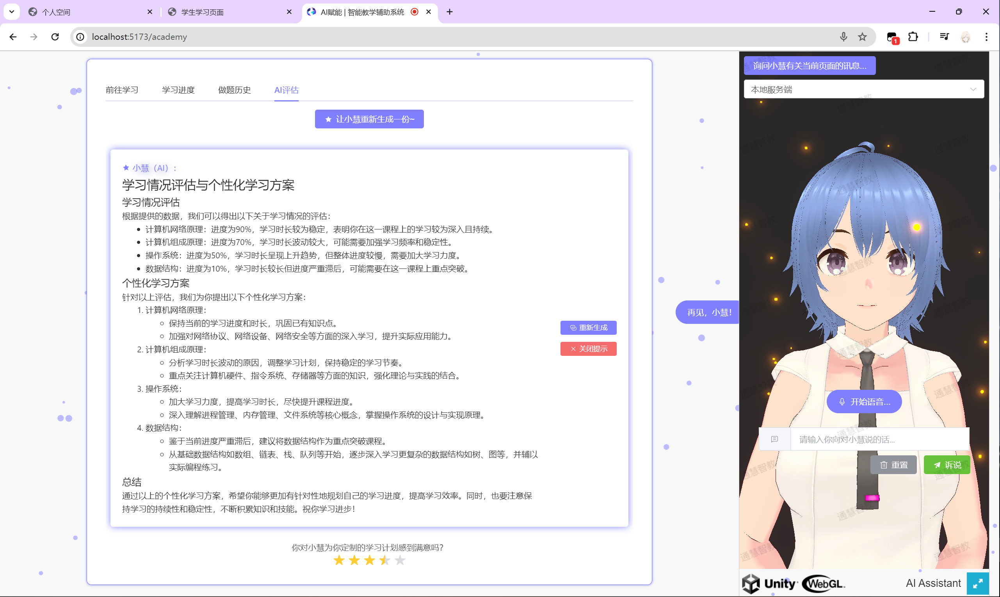

<div align="center">
<h1> AI赋能的智能教学辅助平台💯</h1>

支持**自然语言交互**的智能教学辅助平台

[](https://github.com/TochusC/ai-assistant-teaching-website)

[**简体中文**](./README.md) | [**English**](./docs/en/README.md)

恭喜**AI助理-小慧**在下列赛事中荣获国家级奖项👏：

[(第16届)中国大学生计算机设计大赛](https://jsjds.blcu.edu.cn/)-软件应用与开发赛道-**国家一等奖**

[第13届“中国软件杯”大学生软件设计大赛](https://www.cnsoftbei.com/)-A5-基于讯飞人工智能平台数智化教育应用软件开发赛道-**国家二等奖**

[2024中国高校计算机大赛-网络技术挑战赛](http://net.c4best.cn/)-A1创意赛道-**国家三等奖**


</div>

---

## Vue3 + Unity(WebGL)的智能教学辅助平台📚

***
### 阶段性完成，施工暂告段落🛠️...
***

使用大语言模型作为你的私人助理，让（他/她/它）帮助你在教学平台上进行导航，查询教学信息，总结网页内容，解决你的疑难，满足你的要求，甚至是与（他/她/它）聊天说地，谈情说爱等！

***
### 提供全新的网页交互逻辑👾！
不再需要用鼠标在繁琐复杂各个网页条目、导航下点击浏览；不再需要去学习繁琐的网页业务逻辑、操作方式；不再需要观察分析网页展示的个各种冷冰冰的图表数据。
#### 通过文字和语音的方式，使用自然语言来操作网页✨！
通过智能教学助理进行文字或语音交流， 智能教学助理将帮助你跳转到相应的网页模块下，并协助你总结网页内容，分析图表数据，协助你无阻碍畅游教学平台，完成教学任务。
### 大模型实时反馈，定制化学习评估🌟！
***
### 认识你的智能教学助理---小慧❤️！

通过语音转文本（STT）、大语言模型（LLM）、文本转语音（TTS）等技术，
我们创造了智能教学助理小慧，并把她介绍给你🥰。

<div align="center">

</div>

不想学习复杂的教学平台的业务逻辑？没关系！

~~让小慧来帮助学生提交作业、完成任务；帮助教师完成对课堂进行考勤、布置作业的繁琐操作。~~

很可惜，目前小慧只能进行路由导航，但布置作业、查询后台数据、填写表单等功能是**理论可以实现的**。

无论是任何任务，只需跟小慧说一句话，小慧势必为你赴汤蹈火🔥，并尽其所能地满足你的需求！

***
##### 语音转文本（STT）由百度提供的短语音识别极速版服务实现
##### 大语言模型（LMM）为百度提供的ERNIE 3.5
##### ~~文本转语音 （TTS）通过GitHub项目[GPT-SoVits](https://github.com/RVC-Boss/GPT-SoVITS)实现~~
##### 文本转语音 （TTS）通过百度的短文本语音合成实现（发音人为per6-度小萌）


### 平台预览❓

---
#### 网站主页



#### 学习进度评估


#### 个性化学习计划生成


#### 我的学堂页面（深色模式）


### 运行项目🚀：
#### 环境准备🔨：
***

项目使用Node.js v18.18.0作为运行环境，通过Vue3框架进行开发。

前端使用了[Naive UI](https://www.naiveui.com/), [Element-Plus](https://element-plus.org/)组件库.
同时还添加了通过[Spline](https://spline.design/)实现的三维交互模型。

后端使用Django作为服务端框架, Python版本3.12.0，项目一共有三个后端服务，均位于`/affiliate-project`目录下。

其分别是:
- AvatarServer，虚拟人服务端，负责调用百度的语音识别服务、大语言模型服务，以及百度的语音合成服务。
- backend，数据服务端，使用SQLite数据库，负责储存网站后台数据，包括用户信息、课程信息、作业信息等。
- cdn，静态文件服务端，负责储存网站的静态文件，包括图片、音频、视频等。

在运行项目请先使用:
```shell
npm instal
```
来安装package.json中所需要的库和依赖

使用
```shell
npm run dev
```
即可启动项目前端，通过访问[http://127.0.0.1:5173/](http://127.0.0.1:5173/)即可遇见小慧啦。

但如果想要进入教学网站中，并让小慧开始工作，则需要分别启动三种后端服务:

分别进入`/affiliate-project`目录下的`AvatarServer`、`backend`、`cdn`目录，

##### 在运行Django后端之前，请确认你已经安装了Python及相应库，如Django、Requests等，详见各后端下的`requirements.txt`及`readme.md`文件。

分别运行对应目录下的`run.bat`文件，即可启动后端服务。

玩好😉！

### 须知❗：
***
智能人工助理小慧可以帮助用户进行路由跳转功能，只需用自然语言描述你的需求，小慧会帮助你完成跳转。

具体的实现过程请参见`/src/components/UnityInteraction.vue`文件。

项目除虚拟教学助理小慧外，并没有什么其他亮点了，
虚拟人小慧被我们实现在了`/src/components/UnityComponent.vue`组件中，欢迎大家来一起探讨🤗。